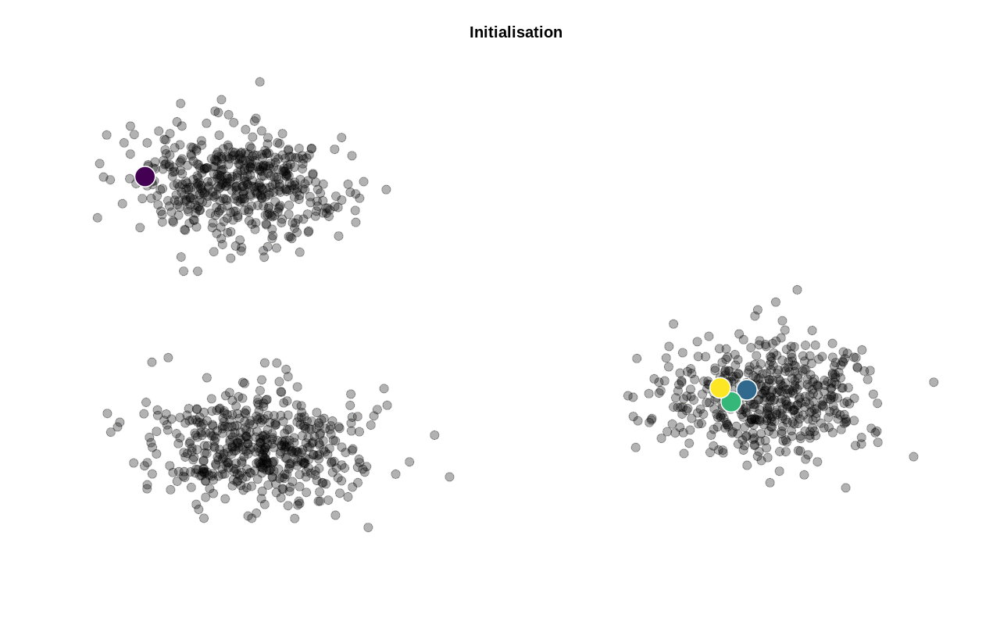

<!-- 
---
title: K-means 
output: pdf_document
geometry: "left=4cm,right=4cm,top=1.5cm,bottom=2cm"
numbersections: true
---
 -->

<!-- pandoc README.md -o README.pdf --variable urlcolor=blue --highlight-style tango -->



# Objectif

L'objectif consiste à implémenter l'algorithme des K-means (ou tout du moins l'une de ses implémentations les plus connues, [l'algorithme de Lloyd](https://en.wikipedia.org/wiki/Lloyd%27s_algorithm)) :

* en "pur" Python
* avec [NumPy](http://www.numpy.org/)
* en "base" R

L'utilisation d'un [*line profiler*](https://github.com/rkern/line_profiler) permettra de quantifier les gains envisageables permis par l'utilisation d'un "sous-langage" spécialisé pour le calcul scientifique comme `NumPy` par rapport à une implémentation en "pur" Python.

Pour référence, l'implémentation déjà existante de [scikit-learn](https://scikit-learn.org/stable/modules/generated/sklearn.cluster.KMeans.html) (fortement recommmandée pour tout usage un minimum sérieux) sera évoquée.

Sera également proposée une implémentation des K-means en "base" R, c'est-à-dire sans package supplémentaire. Cet exemple permettra de mettre en évidence la forte proximité qui peut exister entre les deux langages (en particulier avec la version NumPy).

# Génération des données

La commande suivante permet de générer un jeu de données avec le nombre de points et de clusters souhaités :

```sh
python 00-generate_data.py --n_points <int> --n_clusters <int>
```

Les deux arguments `--n_points`  et `--n_clusters` sont optionnels avec, respectivement, des valeurs par défaut de 150 et 3.

Les données ainsi créées sont enregistrées dans le sous-répertoire `data` sous la forme : `data_<n_points>.csv`

# Implémentation des K-means en "pur" Python

Pour exécuter l'algorithme des K-means écrit en "pur" Python, il suffit simplement d'écrire :

```sh
python 01-kmeans.py data/<file>
```

Trois paramètres optionnels peuvent être précisés :

* le nombre de clusters avec l'argument `--n_clusters` (3 par défaut) ;
* le nombre maximum d'itérations de l'algorithme avec l'argument `--max_iter` (20 par défaut) ;
* le fait de créer un graphique pour chacune des étapes de l'algorithme avec le flag `--plot` (ou `-p`).

Par exemple, pour créer 4 clusters, stoper l'algorithme après 10 itérations même en l'absence de convergence et activer la représentation graphique :

```sh
python 01-kmeans.py data/<file> --n_clusters 4 --max_iter 10 -p
```

Les figures générées seront stockées dans le sous-répertoire `plots`.

Pour convertir l'ensemble des figures en une animation, utiliser la commande suivante (les paramètres peuvent être ajustés à convenance) :

```sh
convert -delay 100 -loop 0 $(ls -1v plots/*.png) plots/<file>.gif
```

*NB : il est nécessaire d'installer [ImageMagick](http://www.imagemagick.org/) au préalable.*

L'utilisation du module `line_profiler` (et de son script `kernprof`) rend le profiling de l'algorithme trivial ou presque :

* ajouter le *decorator* `@profile` devant la fonction a profilé (kmeans() dans le cas présent) ;
* exécuter la commande suivante :

```sh
kernprof -l -v 01-kmeans.py data/<file>
```

# Implémentation des K-means avec NumPy

L'exécution du script peut se faire avec la commande :

```sh
python 02-kmeans_numpy.py data/<file>
```

Tout comme précédemment, le nombre de clusters peut être modifié avec l'argument `--n_clusters` (3 par défaut) et le nombre maximum d'itérations avec `--max_iter` (20 par défaut).

Pour profiler l’implémentation avec NumPy (après avoir ajouté le *decorator* `@profile` devant la fonction kmeans()):

```sh
kernprof -l -v 02-kmeans_numpy.py data/<file>
```

# Implémentation des K-means avec scikit-learn

Pour exécuter l’implémentation des K-means de scikit-learn :

```sh
python 03-kmeans_sklearn.py data/<file>
```

Comme pour les trois implémentations précédentes, le nombre de clusters peut être ajusté avec l'argument `--n_clusters` (3 par défaut) tout comme le nombre maximum d'itétarion avec `--max_iter` (20 par défaut).

> *Dans cette implémentation, l'algorithme est -- par défaut -- répété 10 fois avec des centres initiaux différents.*

# Implémentation des K-means en "base" R

L'implémentation en R s'exécute de façon très similaire :

```sh
Rscript 04-kmeans.R data/<file>
```

Ici également, trois arguments optionnels sont proposés :

* le nombre de clusters avec l'argument `--n_clusters` (3 par défaut) ;
* le nombre maximum d'itérations de l'algorithme `--max_iter` (20 par défaut) ;
* le fait de créer un graphique pour chacune des étapes de l'algorithme avec le flag `--plot` (ou `-p`).

Le script `05-kmeans_ggplot2.R` s'utilise de façon identique. La seule différence étant que les graphiques sont réalisés avec le package `ggplot2`. 

# Arborescence

```
kmeans
|__ data
|   |__ ...
|__ plots
|	|__ ...
|__ 00-generate_data.py
|__ 01-kmeans.py
|__ 02-kmeans_numpy.py
|__ 03-kmeans_sklearn.py
|__ 04-kmeans.R
|__ 05-kmeans_ggplot2.R
```
